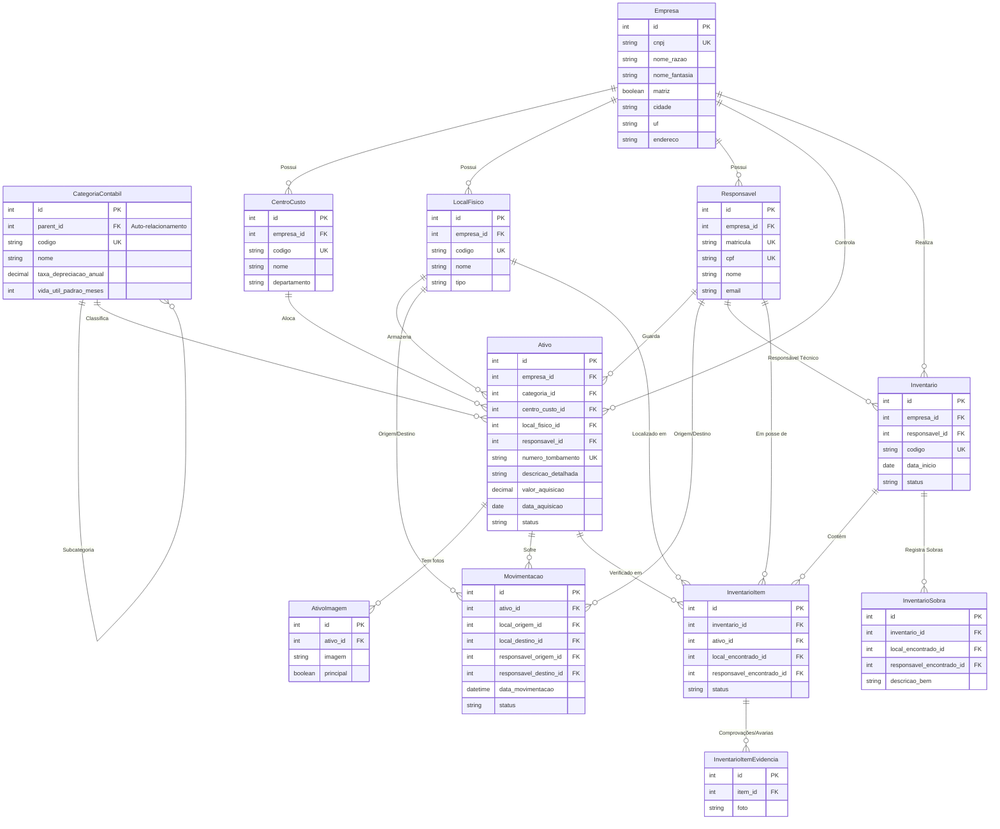
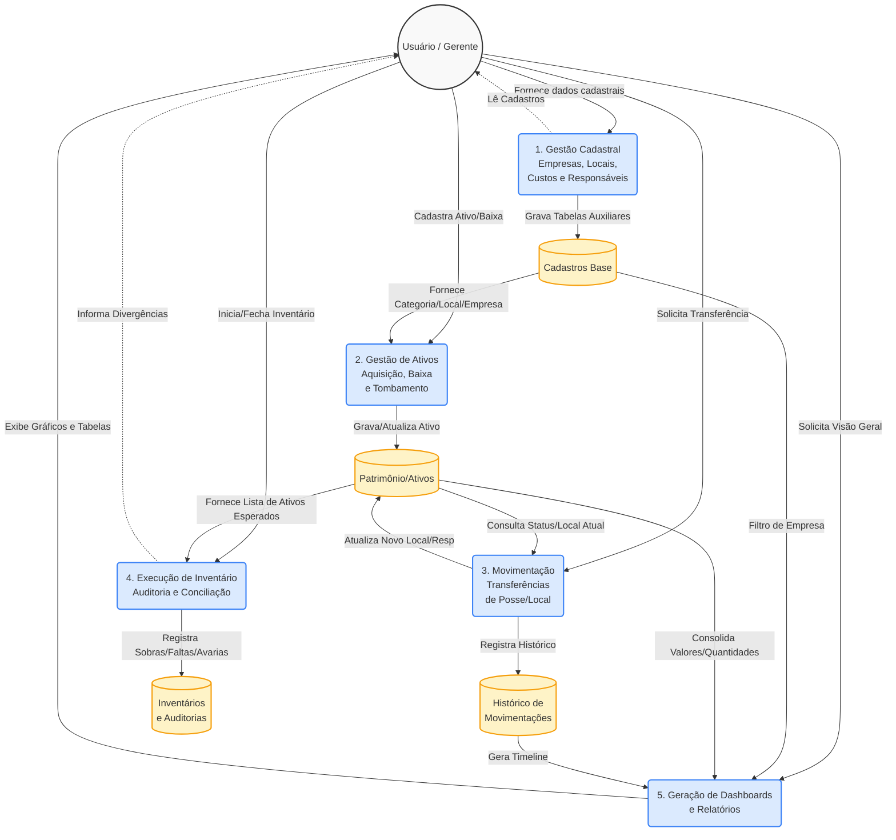

# Documentação de Diagramas - Controle Patrimonial

Abaixo estão as representações visuais em diagramas documentando a Arquitetura de Dados e o Fluxo de Informação do sistema.

## 1. Diagrama Entidade-Relacionamento (ERD)
Este diagrama ilustra como as tabelas do banco de dados se relacionam entre si, incluindo as chaves estrangeiras (Foreign Keys) e as entidades do sistema.

---

## 2. Diagrama de Fluxo de Dados (DFD) - Nível 1
Este diagrama representa as principais interações do usuário com o sistema e os processos de fluxo de informação e guarda de dados na base.

